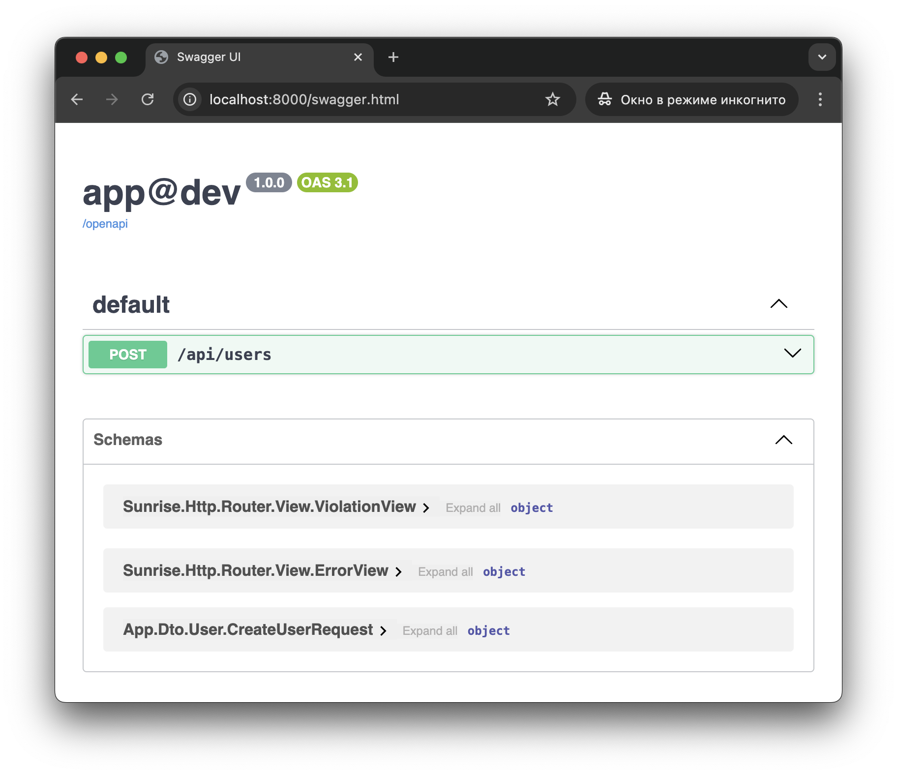

# API Endpoint for Creating a User :id=top

This is a demonstration example and does not include storage logic—it only provides a starting point.

First, create a DTO that represents data expected from the client.

> Refer to the [Hydrator Annotation Reference](/docs/reference/hydrator-annotations.md) to learn about additional hydrator features.

> Refer to the [Type Conversion Reference](/docs/reference/type-conversion.md) to learn how the hydrator handles types.

```php
declare(strict_types=1);

namespace App\Dto\User;

use SensitiveParameter;

final readonly class CreateUserRequest
{
    public function __construct(
        #[SensitiveParameter]
        public string $email,
        #[SensitiveParameter]
        public string $password,
    ) {
    }
}
```

Next, create a controller and an action to handle the client's request.

> Refer to the [Controller Annotation Reference](/docs/reference/controller-annotations.md) to learn about additional router features.

```php
declare(strict_types=1);

namespace App\Controller\Api;

use App\Dictionary\MediaType;
use App\Dto\User\CreateUserRequest;
use Sunrise\Http\Router\Annotation\Consumes;
use Sunrise\Http\Router\Annotation\PostApiRoute;
use Sunrise\Http\Router\Annotation\RequestBody;

final readonly class UserController
{
    #[PostApiRoute('api.users.create', '/api/users')]
    #[Consumes(MediaType::JSON)]
    public function createUser(
        #[RequestBody]
        CreateUserRequest $createUserRequest,
    ): void {
    }
}
```

Next, test this endpoint using the `cURL` utility.

```bash
curl -i -X POST -H 'Content-Type: application/json' -d '{"email":"foo@example.com","password":"P@$$w0rD"}' http://localhost:8000/api/users
```

```text
HTTP/1.1 204 No Content
Host: localhost:8000
Date: Fri, 21 Feb 2025 03:46:17 GMT
Connection: close
X-Powered-By: PHP/8.4.3

```

Next, update the API documentation.

```bash
php bin/app router:openapi:build-document
```

The updated **Swagger** should look something like the screenshot below.


