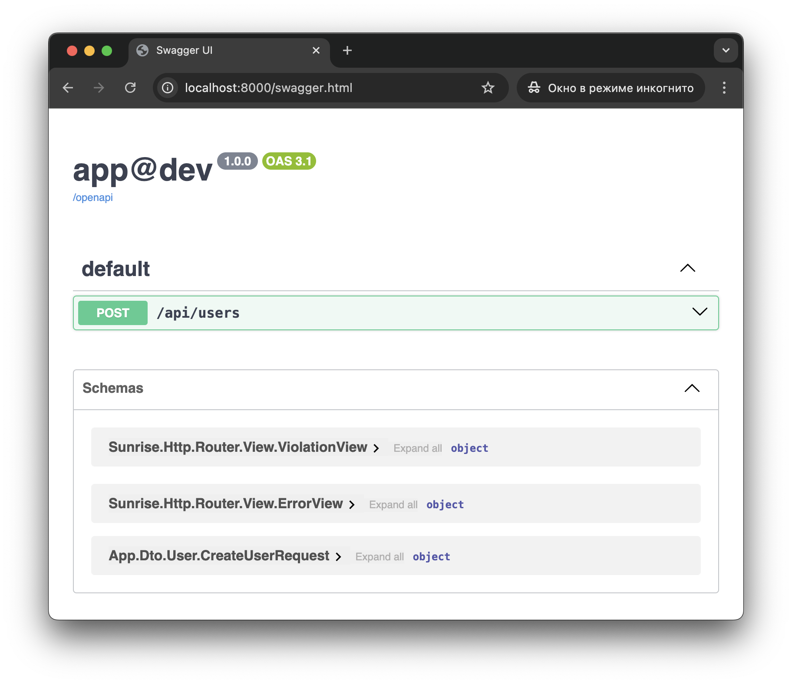

# Create User

## Request DTO

Create a request DTO:

> **Note**: If you're using PHP 8.2+, always define DTOs as a [readonly class](https://www.php.net/manual/en/language.oop5.basic.php#language.oop5.basic.class.readonly).

> **Note**: If you're using PHP 8.2+, always mark sensitive parameters with #[[SensitiveParameter](https://www.php.net/manual/en/class.sensitiveparameter.php)].

```php
declare(strict_types=1);

namespace App\Dto\User;

final class CreateUserRequest
{
    public function __construct(
        public readonly string $email,
        public readonly string $password,
    ) {
    }
}
```

## Controller

Create a controller:

> **Note**: Check the [reference for annotations](/docs/reference/router-annotations.md) to learn more about each one.

```php

declare(strict_types=1);

namespace App\Controller\Api;

use App\Dictionary\MediaType;
use App\Dto\User\CreateUserRequest;
use Sunrise\Http\Router\Annotation\Consumes;
use Sunrise\Http\Router\Annotation\PostApiRoute;
use Sunrise\Http\Router\Annotation\RequestBody;

final class UserController
{
    #[PostApiRoute('api.users.create', '/api/users')]
    #[Consumes(MediaType::JSON)]
    public function createUser(#[RequestBody] CreateUserRequest $createUserRequest): void
    {
    }
}
```

## cURL

Test the result:

```bash
curl -i -X POST -H 'Content-Type: application/json' -d '{"email":"foo@example.com","password":"P@$$w0rD"}' http://localhost:8000/api/users
```

```text
HTTP/1.1 204 No Content
Host: localhost:8000
Date: Fri, 21 Feb 2025 03:46:17 GMT
Connection: close
X-Powered-By: PHP/8.4.3

```

## Update Swagger

```bash
php bin/app router:openapi:build-document
```


