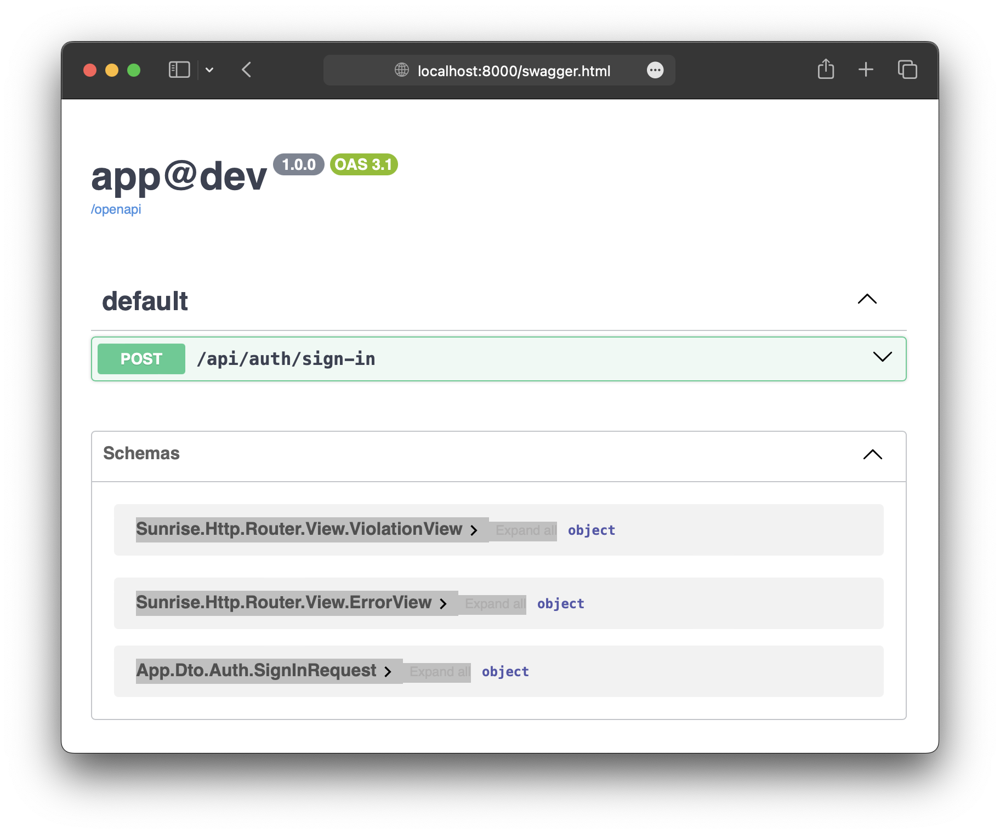

# User Sign In Operation :id=top

**This example only provides a starting point.**

First, create a DTO that defines the expected client data.

> Refer to the [Hydrator Annotation Reference](/docs/reference/hydrator-annotations.md) to learn about additional [hydrator](/docs/packages/sunrise/hydrator/) features.

> Refer to the [Type Conversion Reference](/docs/reference/type-conversion.md) to learn how the [hydrator](/docs/packages/sunrise/hydrator/) handles types.

```php
declare(strict_types=1);

namespace App\Dto\Auth;

use SensitiveParameter;

final readonly class SignInRequest
{
    public function __construct(
        #[SensitiveParameter]
        public string $email,
        #[SensitiveParameter]
        public string $password,
    ) {
    }
}
```

Next, create a controller with an action that handles the client's request.

> Refer to the [Routing Annotation Reference](/docs/reference/routing-annotations.md) to learn about additional [router](/docs/packages/sunrise/http-router/) features.

```php
declare(strict_types=1);

namespace App\Controller\Api;

use App\Dictionary\MediaType;
use App\Dto\Auth\SignInRequest;
use Sunrise\Http\Router\Annotation\Consumes;
use Sunrise\Http\Router\Annotation\PostApiRoute;
use Sunrise\Http\Router\Annotation\RequestBody;

final readonly class AuthController
{
    #[PostApiRoute('api.auth.signIn', '/api/auth/sign-in')]
    #[Consumes(MediaType::JSON)]
    public function signIn(
        #[RequestBody]
        SignInRequest $signInRequest,
    ): void {
    }
}
```

Next, test this operation using the `cURL` utility.

```bash
curl -i -X POST -H 'Content-Type: application/json' -d '{"email":"foo@example.com","password":"P@$$w0rD"}' http://localhost:8000/api/auth/sign-in
```

```text
HTTP/1.1 204 No Content
Host: localhost:8000
Date: Fri, 21 Feb 2025 03:46:17 GMT
Connection: close
X-Powered-By: PHP/8.4.3

```

_Response from the server._

Next, update the API documentation.

```bash
php bin/app router:openapi:build-document
```

The updated [Swagger](http://localhost:8000/swagger.html) should look something like the screenshot below.


