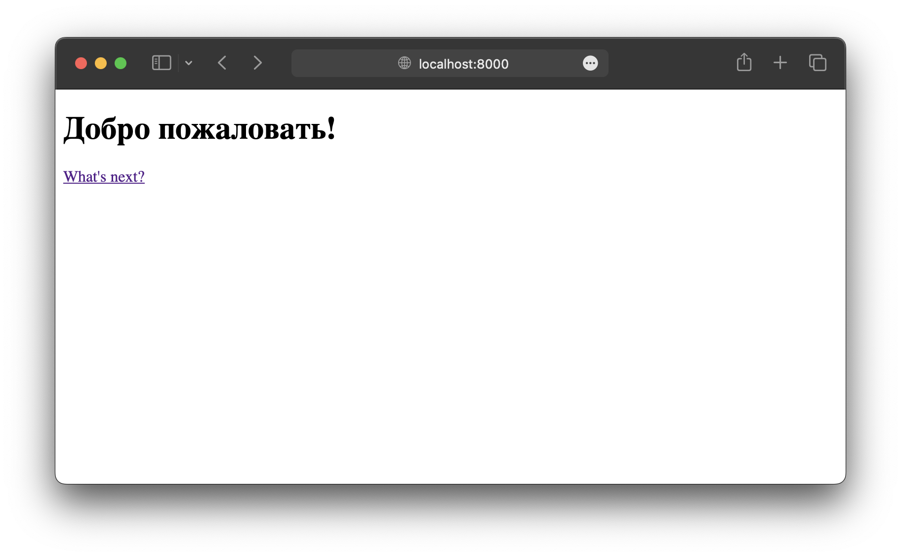
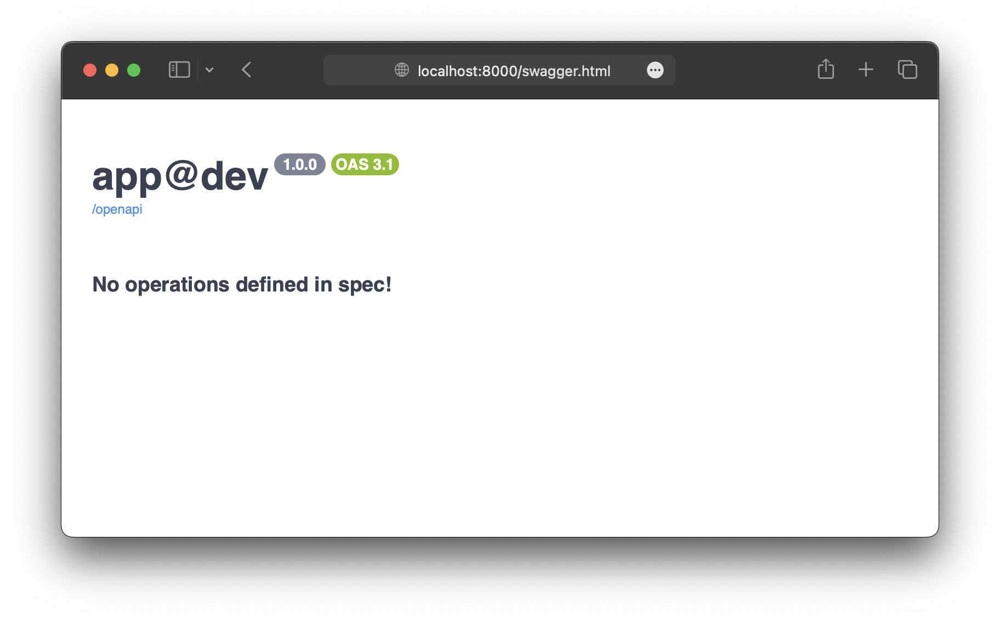
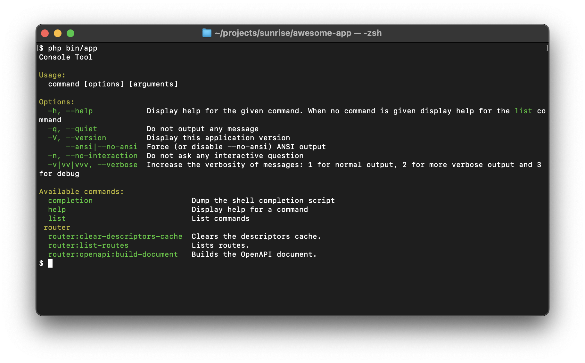

# sunrise/awesome-skeleton :id=top

An awesome skeleton for modern PHP development.


> Awesome Skeleton is based on the [PHP-DI](https://php-di.org/) container. Study it to better understand your project.

## Key Features

- Immutable architecture
- Direct injection of DTO objects into controllers
- Sending View objects directly from controllers
- Self-documenting API
- Localization
- Error handling
- High flexibility

## System Requirements

- [PHP 8.1+](https://www.php.net/install)
- [composer](https://getcomposer.org/download/)

## Installation

The following command will create a new project in the `awesome-app` directory:

> The directory name `awesome-app` is used for demonstration purposes. You should choose a more meaningful name.

```bash
composer create-project sunrise/awesome-skeleton awesome-app/
```

Don't forget to navigate to your project's directory as follows:

```bash
cd awesome-app/
```

## Running

The following command will run your project on the built-in PHP web server, which will be accessible at `localhost:8000`:

> The [built-in PHP web server](https://www.php.net/manual/en/features.commandline.webserver.php) must be used for demonstration purposes only.

> The address `localhost:8000` is used for demonstration purposes. You can use a different address.

```bash
php -S localhost:8000 public/index.php
```

After running this command, your project should be available at the following address:

http://localhost:8000/

The following command will request the home page of your project using the cURL utility:

> You can request data from the server in a specific format and language using the `Accept` and `Accept-Language` headers.

> The [WelcomeController](https://github.com/sunrise-php/awesome-skeleton/blob/eb8d4bd6ae09394a9204b9e8edd3a67f9237b8a0/src/Controller/WelcomeController.php) is created for demonstration purposes. In API controllers, you won't have to manually determine the response format.

```bash
curl -X GET -H 'accept: application/json' -H 'accept-language: ru' http://localhost:8000/
```

In response, you should see something like this:

```json
{
    "message": "Добро пожаловать!"
}
```

If you open your project in a browser, you should see a **localized** welcome message as shown in the screenshot below:



## Swagger

The following command will generate the OpenAPI documentation for all API operations in your project:

```bash
php bin/app router:openapi:build-document
```

Swagger should be available at the following address:

http://localhost:8000/swagger.html

> By default, your project does not include any API operations, so Swagger will notify you about this.
> To see at least something in Swagger, you can [create your first API operation](/docs/cookbook/api-endpoint-for-creating-user.md) right away.



## CLI

To access your project via the command line, use the following command:

```bash
php bin/app
```

After running this command, the output should look similar to the screenshot below:



## Testing

To run the tests, execute the following command:

```bash
composer test
```

## Production

Make sure to configure the cache in:

```text
config/definitions/prod/cache.php
```

Don't forget to change the environment variable `APP_ENV` in the `.env` to:

```ini
APP_ENV=prod
```

After deployment, remember to clear the router cache:

```bash
php bin/app router:clear-descriptors-cache
```

## What's next?

- [Create your first API operation](/docs/cookbook/api-endpoint-for-creating-user.md)

## Dependencies

Your project will be based on the following open-source solutions:

- [monolog/monolog](https://packagist.org/packages/monolog/monolog)
- [php-di/php-di](https://packagist.org/packages/php-di/php-di)
- [sunrise/coder](/docs/packages/sunrise/coder/)
- [sunrise/http-message](/docs/packages/sunrise/http-message/)
- [sunrise/http-router](/docs/packages/sunrise/http-router/)
- [sunrise/hydrator](/docs/packages/sunrise/hydrator/)
- [sunrise/translator](/docs/packages/sunrise/translator/)
- [symfony/cache](https://packagist.org/packages/symfony/cache)
- [symfony/console](https://packagist.org/packages/symfony/console)
- [symfony/dotenv](https://packagist.org/packages/symfony/dotenv)

The development environment will also use the following open-source solutions:

- [phpstan/phpstan](https://packagist.org/packages/phpstan/phpstan)
- [phpunit/phpunit](https://packagist.org/packages/phpunit/phpunit)
- [squizlabs/php_codesniffer](https://packagist.org/packages/squizlabs/php_codesniffer)
- [vimeo/psalm](https://packagist.org/packages/vimeo/psalm)
